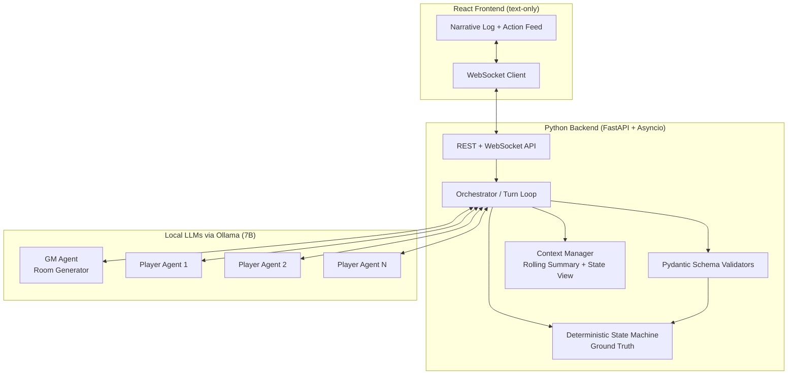

# Project Document — Multi-LLM Agent Escape Room Simulation

> This is the authoritative technical reference for the project. Update it whenever there are **architectural changes**.

---

## 1. Vision

A web-facing, text-only narrative game in which a **Game Master (GM) LLM** dynamically designs a puzzle-filled escape room, and multiple **Player LLMs** must communicate, collaborate, and execute structured actions to solve the puzzles and escape.

All LLMs are **local 7B-parameter models**. Because small models hallucinate easily and have limited context windows, the architecture is explicitly designed to:

1. Keep a **deterministic ground-truth state** outside the LLMs.
2. Enforce **strict JSON schemas** on every LLM input/output boundary.
3. **Manage context** so models never "forget" the world state or lose the plot.

---

## 2. High-Level Architecture



### 2.1 Backend Runtime Lifecycle (authoritative path)
The backend is intentionally structured as a deterministic control loop around
LLM policy calls. Every turn follows this sequence:

1. Content load and normalization:
   The server loads authored content (legacy `GameSetting` OR fixed
   `{"world": ...}` format), normalizes it through `load_setting_compat(...)`,
   and validates a runtime `GameSetting`.
2. Deterministic state initialization:
   `GameState.from_setting()` builds canonical state (object states/locations,
   player locations/inventory, accessible rooms, power flags, discovered info).
3. Context synthesis:
   `TeamCognition` and `GameStateView` derive compact, authoritative context:
   current goal, blockers, objective board, candidate actions, ownership,
   teammate hypotheses, do-not-repeat memory, and private clues.
4. Constrained LLM decision:
   `GamePlayerAgent.decide()` calls Ollama structured outputs (schema-constrained
   decode) to produce a `GameTurn` object.
5. Deterministic pre-execution guards:
   The orchestrator checks blocked/redundant/already-done conditions and can
   re-decide before consuming a turn.
6. Deterministic execution:
   `GameSimulator.step()` applies one validated `GameAction` and returns a
   grounded `Observation`.
7. Deterministic cognition update:
   `TeamCognition.observe()` records attempts, updates milestones/stall flags,
   refreshes plan progress, and emits progress/stuck signals.
8. Event streaming:
   Structured events (`speech`, `observation`, `system`, `prompt`, `decision`,
   optional `narration`) are streamed to WebSocket clients.

This architecture keeps model reasoning inside bounded decision tasks and keeps
all persistence/progression correctness in code.

### 2.2 Trust Boundaries
- Trusted deterministic core:
  `schemas/`, `engine/`, `cognition/`, orchestrator guard logic.
- Untrusted probabilistic layer:
  LLM outputs (always parsed/validated/repaired before use).
- Observer-only presentation layer:
  narration/prompt/decision debug streams do not mutate game state.

### 2.3 Data Contracts Between Layers
- Content contract:
  authored fixed-world `{"world": ...}` OR legacy `GameSetting` dict.
- Runtime world contract:
  validated `GameSetting`.
- Action contract:
  `GameAction` with verb-specific required fields (deterministic schema checks).
- Turn contract:
  `GameTurn` (`reflection`, `hypothesis`, `speak`, `action`) produced through
  schema-constrained decode.
- Execution outcome contract:
  `Observation` (success/failure, grounded message, optional non-spoiler hint).

### Core principle: the LLM is never the source of truth
- The **State Machine** holds the only authoritative world state (rooms, inventory, lock statuses, variables, flags).
- LLMs **propose** actions as JSON; the State Machine **validates and applies** them.
- The result of every action is fed back as a grounded **Observation**, so the model corrects its own mental model each turn.

---

## 3. Components

### 3.1 GM Game Setting (v2 schema — Phase 3.5)
- A Pydantic schema (`GameSetting`) describing a complete room as a **flat list of
  objects**, each with an `id`, a `location` (a room id OR another object id for
  nesting), a `description`, and a `state` (`fixed`/`visible`/`hidden`/`locked`/
  `locked_bolt`/`locked_room`/`unlocked`/`open`/`taken`/`powered`).
- Progress is gated by **requirement fields** on objects:
  `requires_code` (+`code_digits`), `requires_tool`, `requires_liquid`,
  `requires_power`, and `fuses` (a power source map like `{"A":"OFF","B":"ON"}`).
- Optional **engine hints** stage puzzles: `reveals` (flip a hidden object visible),
  `connects_to` (a door's target room), `provides_power` (flag set once a tool
  requirement is met), `liquid_property`.
- Optional **extensions** for authored multiplayer games: `start_room`, `players`,
  and `player_clues` (asymmetric information). Raw GM-generated settings may omit them.
- A `model_validator` enforces referential integrity (every location/tool/reveal/
  connects_to/win target/clue ref resolves), valid fuse values, containment-cycle
  freedom, and an achievable `win_condition` — anti-hallucination at parse time.
- The GM LLM emits JSON conforming to this schema; invalid output is rejected and
  regenerated (retry-with-repair loop).

> The earlier v1 `RoomBlueprint` schema (rooms/objects/items/locks/puzzles) remains in
> the codebase intact and tested, but **`GameSetting` is the forward path** and the
> schema the GM LLM now generates.

### 3.1.1 Fixed Story Format Compatibility (2026-06-02)
- Added a compatibility adapter for the new authored-story fixed format:
  `{"world": {scenario, objective, rooms[], objects[], rules, solution_path,
  win_condition}}`.
- New schema module: `app/schemas/fixed_world.py`.
- Runtime strategy: **normalize fixed-world payloads into `GameSetting`** so the
  existing deterministic simulator, orchestrator, and prompts continue to work
  unchanged.
- `load_setting_compat(data)` accepts either legacy `GameSetting` dicts or the
  new fixed-world envelope and returns a validated runtime `GameSetting`.
- Adapter behaviors:
  - Flattens rich room objects to runtime room ids.
  - Infers door `connects_to` links from room adjacency where omitted.
  - Normalizes symbolic numeric codes (e.g. `door_code_842`) to executable codes
    (`842`) when `code_digits` indicates a numeric lock.
  - Injects a default 2-player cooperative cast when fixed stories omit personas,
    so multi-agent runs still work.
- Web server `current_setting()` now uses the compatibility loader, enabling one
  entry point for both old and new authored formats.

### 3.2 World Simulator / State Machine (v2 — Phase 3.5)
- Pure-Python deterministic engine (`GameState` + `GameSimulator`). No LLM calls inside.
- `GameState.from_setting()` loads a validated `GameSetting` into runtime state;
  resolves nested locations via location chains, computes per-player visibility,
  recomputes power flags from fuses, and auto-unlocks `requires_power` consumers.
- Exposes a fixed set of **action handlers**: `look`, `inspect`, `take`, `enter_code`,
  `use`, `set_fuse`, `move`, `give`, `say`.
- Each handler returns a structured `Observation` (success/failure + grounded
  description). The `Observation` model is **shared** with the v1 engine.

### 3.3 Player Agents (v2 — Phase 3/4)
- Each player has a **persona** and **asymmetric information / skills** (`player_clues`).
- Interact via a strict turn loop, emitting one validated `GameTurn` JSON object
  per turn (`{reflection, hypothesis, speak, action}`).
- `action` is validated against the v2 `GameAction` schema before the engine sees it.
- Output shape is enforced at decode time via **Ollama structured outputs**
  (the `GameTurn` JSON Schema is passed as `format`), so the model cannot emit
  malformed JSON; the text schema is therefore omitted from the prompt.
- Implemented by `GamePlayerAgent.decide()`: rebuild grounded context from
  `GameState` (the `GameStateView` re-pins room/objects/inventory/exits each turn,
  using bracketed `[id]`s), re-pin persona + action grammar in the system prompt,
  call Ollama with schema-constrained decode, and parse/validate into a valid
  `GameTurn`.

### 3.4 Orchestration Loop (Phase 4)
- `GameOrchestrator` owns the `GameSimulator` (ground truth), the shared
  `MessageLog`, and the list of `GamePlayerAgent`s.
- **Raw asyncio** turn scheduler: round-robin over players; each turn records the
  public `speak`, applies the validated action to the simulator, and records the
  grounded `Observation` (broadcast if public, else private to the actor).
- Streams every `Event` to an optional async `on_event` sink — the integration
  point for the Phase 5 WebSocket layer. Ends on win or turn limit, returning a
  `GameResult` (won / turns / reason / events). LangGraph is a possible later upgrade.

### 3.5 External Cognition (Phase 9)
- `app/cognition/team_cognition.py` — `TeamCognition` is a **deterministic
  external brain** that owns execution-control reasoning the LLM is bad at:
  - **Symbolic state** — `world_fingerprint(state)` hashes object states/locations,
    player locations/inventories, accessible rooms, power flags, discovered info.
  - **Episodic memory** — every action becomes an `AttemptRecord`
    (turn, player, signature, world fingerprint *before* the action, success, outcome).
  - **Loop guard** — `is_redundant(player, action, world_key)` blocks an action
    already tried in the identical world (guaranteed no-op); free actions never blocked.
  - **Progress ledger** — `compute_milestones(state)` (`opened:…`, `took:…`,
    `reached:…`, `learned:…`, `power:…`) gives monotonic intermediate-reward signals.
  - **Stall + reflection scheduling** — stuck flag after `stall_threshold`
    no-progress turns; `should_reflect(turn)` every `reflect_every` turns.
  - **Curiosity + summarized memory** — surfaces untried reachable objects; stores
    the agent's `reflection` text as the team summary (avoids transcript poisoning).
- The orchestrator owns one `TeamCognition`; on a redundant proposal it **re-prompts**
  the agent (up to `max_redecide`) with a block note instead of burning the turn.
  The LLM is restricted to reasoning / interpretation / hypothesis generation.

### 3.6 Objective Board + Collaborative Plan (Phase 10)
- **Goal-level no-repeat.** Phase 9 only blocked *identical-world* repeats; agents
  still re-did already-**accomplished** goals once the world had drifted.
  `already_done(player, action, state)` (extends `team_cognition.py`) blocks, from
  current authoritative state, re-taking a taken item, re-entering a code / setting
  a fuse on an already-open object, re-using an applied tool, and moving to the room
  you are already in. The orchestrator's guard is now `blocked_reason(player, action,
  world_key, state)` — free actions pass, else the goal-level "ALREADY DONE" note,
  else the Phase 9 identical-world note.
- **Objective board (`derive_board(state) → SolutionBoard`).** Recomputed from
  `GameState` every turn (never stored, so it cannot drift): SOLVED = opened/taken
  objects, learned info, restored power, reached rooms; STILL-TO-DO = locked
  interactable objects with a **non-spoiler** requirement hint, plus the WIN
  CONDITION until met. Shown at the top of every `TeamBrief` as the ground truth the
  team trusts over its own memory.
- **Collaborative plan.** `agent.propose_plan(...)` (+ `PlanProposal` schema and plan
  prompts) and `GameOrchestrator._plan_phase()` run a multi-agent **propose →
  critique/refine** debate once before round 1, store one shared `TeamPlan`, and
  announce `📋 Shared plan agreed`. The plan auto-ticks via solved object ids;
  the deterministic SOLVED/UNSOLVED board stays authoritative. Falls back to
  `setting.solution_path` on any LLM failure (gated by `enable_planning`).
- **Small-model prompt simplification + visibility.** Per-turn `GameTurn` no
  longer requires a private `thought`; prompt context is slimmed to CURRENT
  STATE, PRIVATE KNOWLEDGE, TEAM MEMORY/GOAL/BLOCKERS, and RECENT EVENTS to
  reduce duplicated reasoning load on 7B models. The orchestrator now streams
  the exact prompt payload passed to each agent as `EventKind.PROMPT` (UI-visible
  debug events, not written back into agent memory/log state).

### 3.7 Generic Multi-Agent Decision Architecture (Orchestrator-Centric)
- **Core rule:** the LLM is a decision-maker, not the source of truth. The
  orchestrator/environment own state tracking, objective derivation, memory,
  planning, and validation.
- **State extraction layer:** agents receive concise, structured, current facts
  (location, visible objects, inventory, reachable exits, nearby players) rather
  than raw engine internals or long transcripts.
- **Team memory layer:** stores durable facts and failed-attempt summaries
  (`TEAM MEMORY`, `FAILED ATTEMPTS`) instead of full dialogue history.
- **Objective layer:** derives `CURRENT GOAL` and unsolved objectives directly
  from authoritative `GameState` each turn; avoids stale static checklists.
- **Candidate action layer:** orchestrator proposes valid/reachable/progress-
  biased options from current state; agents choose among these and may critique
  with `hypothesis` / `speak`.
- **Functional roles:** per-turn functional roles (`Explorer`, `Solver`,
  `Critic`) guide behavior independently of character flavor.
- **Validation gate:** invalid/redundant/already-solved actions are blocked
  before execution with explicit reason and forced re-decide, so invalid choices
  do not consume game turns.
- **Progress heuristic:** rewards information/state expansion (new rooms,
  discoveries, unlocks, power restoration) and penalizes repeated inspections,
  repeated failures, and solved-objective revisits.

### 3.8 Backend Module Responsibilities (detailed)
- `app/web/`:
  API surface (`/api/setting`, `/ws/game`), serialization, stream runner.
- `app/schemas/`:
  all contracts (content, actions, turns) and parse-time integrity checks.
- `app/schemas/fixed_world.py`:
  compatibility adapter from fixed authored format to runtime `GameSetting`.
- `app/engine/`:
  deterministic simulation (`GameState`, `GameSimulator`, handlers, observation).
- `app/agents/`:
  player/GM prompt assembly and LLM wrappers (policy proposal only).
- `app/llm/`:
  transport, structured decode mode, and repair loop utilities.
- `app/cognition/`:
  execution-control intelligence (objective derivation, no-repeat, progress,
  stall, candidate compilation, shared-plan tracking).
- `app/orchestrator/`:
  turn scheduler and guardrail coordinator between cognition, agents, and engine.
- `app/context/`:
  player-visible state rendering and team-brief rendering.
- `app/game/`:
  authored content payloads and defaults.

### 3.9 Failure Handling and Recovery
- Invalid LLM JSON shape:
  blocked at schema boundary and repaired/retried.
- Structurally valid but semantically pointless action:
  blocked via `blocked_reason(...)` and re-decide loop.
- Action payload field mistakes (e.g., wrong target field):
  deterministic normalization/required-field validation at `GameAction` boundary.
- Model indecision or repeated no-progress behavior:
  cognition marks stuck state and emits re-evaluate guidance.
- Narration failures:
  deterministic fallback text; narration never blocks engine progress.

---

## 4. Anti-Hallucination & Context Strategy

| Risk | Mitigation |
|------|-----------|
| LLM invents items/exits | State Machine rejects actions on nonexistent entities; returns grounded failure Observation |
| LLM mis-tracks state | Each turn injects a **fresh structured State View** (what the player can currently see/hold) |
| Free-text drift | **JSON schema enforcement** (Pydantic) on all actions; reject + repair invalid output |
| Context overflow (7B small window) | **Rolling summary**: old dialogue compressed; recent turns + structured state kept verbatim |
| Forgetting goal/persona | Persona + objective + win-conditions re-pinned in the **system prompt every turn** |
| Cross-agent confusion | Each agent sees only its own private clues + public shared channel |

### Per-turn prompt assembly (Player)
```
[System]  Persona + skills + operating rules + action grammar
[State]   Current room view, visible objects, inventory, exits
[Private] This player's asymmetric clues
[Team]    Objective board, blockers, memory, ownership, candidates, plan step
[Close]   Single-turn instruction tuned to normal/stuck/blocked/reflection mode
```

---

## 5. Technology Stack

| Layer | Choice | Rationale |
|-------|--------|-----------|
| LLM serving | **Ollama** (local) | Easy local 7B hosting, OpenAI-compatible API |
| Backend | **FastAPI + Uvicorn** | Async, WebSocket support, typed |
| Validation | **Pydantic v2** | Schema enforcement / JSON parsing |
| Orchestration | **Asyncio** (LangGraph later) | Transparent, debuggable turn loop |
| Frontend | **React + Vite + TypeScript** | Fast text UI, WebSocket client |
| Realtime | **WebSocket** | Stream narrative + agent turns |
| Python env | **.venv** (3.11.9) | Project-local environment |

---

## 6. Repository Layout

```
Escapee/
├── .venv/
├── backend/
│   ├── app/
│   │   ├── main.py              # ASGI entrypoint (uvicorn app.main:app)
│   │   ├── schemas/             # Pydantic models (game_setting v2, blueprint v1, actions, state)
│   │   ├── engine/              # Deterministic state machine + action handlers (v2 + v1)
│   │   ├── agents/              # GM + Player agent wrappers, prompts (v2 + v1)
│   │   ├── llm/                 # Ollama client, JSON-repair loop
│   │   ├── orchestrator/        # Asyncio turn loop (GameOrchestrator)
│   │   ├── cognition/           # External cognition: TeamCognition (memory, loop guard, progress, reflection)
│   │   ├── context/             # Rolling summary + state-view builders (v2 + v1)
│   │   ├── web/                 # FastAPI app, WebSocket runner, JSON serializers
│   │   └── game/                # Hand-authored settings (orbital_decay v1 + v2) + game_setting.json
│   ├── tests/                   # 73 tests across phases 1–5
│   ├── pytest.ini
│   └── requirements.txt
├── frontend/                    # React + Vite + TS text spectator UI
│   ├── src/ (App, useGameSocket, components/, types, styles)
│   └── package.json, vite.config.ts, tsconfig*.json
├── Journal.md
├── ProjectDocument.md
├── Roadmap.md
└── Overview.md
```

### Running it
- **Backend:** `cd backend && ../.venv/bin/python -m uvicorn app.main:app --reload` (serves on :8000).
- **Frontend:** `cd frontend && npm install && npm run dev` (serves on :5173).
- **LLMs:** a local Ollama server with a model pulled. Default model is `qwen2.5:7b` (`ollama pull qwen2.5:7b`).
- **Headless live run (no UI):** `cd backend && ../.venv/bin/python -m scripts.live_run --model qwen2.5:7b --rounds 24` streams a full game to stdout — handy for prompt tuning.

---

## 7. Change Log
- **2026-06-02** — **Fixed story-format migration (compatibility adapter).**
  Introduced `app/schemas/fixed_world.py` with `load_setting_compat(...)` to
  support the new fixed authored format (`{"world": ...}`) as the stable
  content contract while preserving the existing runtime engine. The adapter
  converts fixed-world rooms/objects into runtime `GameSetting`, infers
  `connects_to` from room adjacency, normalizes symbolic numeric lock codes, and
  injects default cooperative personas when omitted. `app/web/server.py`
  switched `current_setting()` to this loader so old and new formats are both
  accepted transparently. Added tests in `tests/test_fixed_world_format.py`.
- **2026-06-02** — **Inference Control Layer: grammar-constrained structured
  generation.** Replaced loose `format="json"` on the player paths with Ollama
  **native structured outputs**: `OllamaClient.chat` accepts a `format_schema`
  (a JSON-Schema dict) and the player turn / collaborative-plan calls pass
  `GameTurn.model_json_schema()` / `PlanProposal.model_json_schema()`, so Ollama
  constrains decoding token-by-token to a shape-valid object (no dropped commas /
  creative arrays that loop or crash the turn). This is the MLE "offload syntax to
  deterministic decoding" principle without a heavy new dependency (Outlines/
  SGLang) — Ollama enforces the grammar in-process. Because structure is now
  guaranteed by the decoder, the text JSON schema was **deleted from the prompt**:
  the brace-heavy `AVAILABLE ACTIONS` JSON block + `Expected JSON shape` example
  became a plain semantic verb→fields cheatsheet (also removing the entire `{{}}`
  `.format` escaping bug class), and the plan prompt's JSON-shape lines were
  dropped. The GM blueprint path keeps the looser json-mode + repair loop for now
  (its `GameSetting` schema is large and gated by semantic `model_validator`s that
  shape-only decoding can't satisfy). 90/90 backend tests green.
- **2026-06-02** — **Prompt tuning pass: one-goal context + prompt logging.**
  Simplified the v2 player turn contract by removing required private `thought`
  from `GameTurn` and tightening prompt instructions around one CURRENT GOAL,
  BLOCKERS, deterministic TEAM MEMORY, and explicit OWNERSHIP to reduce cognitive
  load for small models (Qwen2.5-7B). Reduced duplicated context sections (dropped
  per-turn story-summary/action-history and recent transcript blocks from v2 prompt assembly). Added
  per-turn prompt observability: orchestrator emits non-recorded `prompt` events
  containing the exact system+user payload sent to the model; web serializers and
  frontend feed now render these debug entries distinctly. 90/90 backend tests
  green; frontend build green.
- **2026-05-29** — Initial architecture authored. Stack and phase plan defined. No code yet.
- **2026-05-30** — Migrated to **GameSetting v2** schema (object + state + requirement model) per user-provided `game_setting.json`. New schema/state/simulator (`GameState`, `GameSimulator`), Orbital Decay ported to v2, GM prompt + `generate_blueprint` retargeted to `GameSetting`. v1 code kept intact; `Observation` + `json_repair` shared. 54/54 tests green.
- **2026-05-30** — Migrated the **player agent path to v2** (`game_turn`, `game_player_prompt`, `game_builder`, `game_player_agent`) and built **Phase 4: the asyncio `GameOrchestrator`** (round-robin ReAct loop, shared `MessageLog`, public/private event routing, injectable `on_event` stream, `GameResult` lifecycle). 66/66 tests green.
- **2026-05-30** — Built **Phase 5: the web app**. Backend `app/web` (FastAPI `WS /ws/game` + `GET /api/setting`, `GameRunner`, grounded JSON serializers) streams setup/event/state/result; `app/main.py` is the ASGI entrypoint. Frontend is a React + Vite + TS text spectator UI (scenario/crew, live narrative feed, grounded state panel). 73/73 tests green; frontend `npm run build` passes.
- **2026-05-31** — **Phase 6: live playthrough + 7B prompt/engine tuning (first live win).** Added `backend/scripts/live_run.py` (headless streaming CLI) and ran end-to-end games against Ollama `qwen2.5:7b`. Fixed observed 7B failures: (1) models copied the `[id]` display form verbatim → added a `GameAction` `model_validator` that strips surrounding brackets/whitespace from id fields; (2) clarified in the player prompt that brackets are display-only (write bare ids); (3) added an anti-loop **"ACTIONS YOU ALREADY TOOK"** section + per-agent action history; (4) clarified that a clue is text (use `enter_code`, never `item_id`) and lowered default temperature 0.7 → 0.4; (5) engine/content bug — `captains_log` was `takeable`, letting a player remove the code from the room; set `takeable: False`. With all fixes the team **escaped in 30 turns**. Default model changed to `qwen2.5:7b`. 74/74 tests green (new bracket-normalization test).
- **2026-06-01** — **Phase 7: GM Narrator (storyteller LLM).** Added a second LLM that turns each turn's structured action + the simulator's authoritative outcome into live present-tense prose for human observers (`app/agents/gm_narrator.py`, `app/agents/gm_narrator_prompt.py`, new `EventKind.NARRATION`). **Presentation-only by design:** narration is streamed via the `on_event` sink but never written to the shared `MessageLog` (new `record` flag on `GameOrchestrator._emit`), so it cannot corrupt ground truth nor leak one player's private observations to another's agent context. Each narrate method has a deterministic fallback so an LLM error never stalls the game. Wired through `GameRunner` (`build_narrator`), the WebSocket (`?narrate=true|false`, default on), `live_run.py` (`--no-narrate`), and the frontend (narration event type, distinct prose rendering, narrate toggle, "Story" feed). 75/75 tests green (new anti-leak narration test); live run verified.
- **2026-06-02** — **Phase 8: multi-agent debate + adaptive decision-making.** Made the team deliberate instead of looping. Added a public `hypothesis` field to `GameTurn` (a theory + proposed next step that teammates can support/critique/counter). The `GameOrchestrator` now keeps a **team blackboard**: latest hypothesis per player, a team-wide **failed-attempt memory** (action signature → why it failed), and a **stall detector** that counts turns since the last *novel successful* action; once it crosses `stall_threshold` (default `max(3, players*2)`) the team is flagged **stuck**, a one-shot "re-evaluate" SYSTEM prompt is emitted, and the flag clears on the next real progress. A new `TeamBrief` (`app/context/game_builder.py`) renders teammate proposals + failed attempts + the stuck banner into a TEAM DISCUSSION section of each prompt, threaded through `agent.decide()`. Hypotheses are broadcast as public `(idea)` speech. The player system prompt was rewritten into 10 explicit collaboration rules (share/divide/debate/don't-repeat-failures/re-evaluate). Debate is encouraged via prompting + blackboard, **not** hard-gated, to avoid 7B deadlock. 79/79 tests green (4 new); live run shows real debate and stuck-recovery.
- **2026-06-09** — **Phase 9: external cognition (memory, symbolic state, loop guard, progress, reflection).** Moved execution control out of the LLM into a deterministic `TeamCognition` (`app/cognition/team_cognition.py`), realizing the principle that the LLM should only reason/interpret/hypothesize, not hold persistent execution state. It maintains a **symbolic world fingerprint** (sha1 over object/player/room/power/info state), an **episodic memory** of every `AttemptRecord` keyed by the pre-action fingerprint, a **loop guard** (`is_redundant`) that blocks actions already tried in an unchanged world, a **milestone progress ledger** that emits intermediate-reward `✓ Progress!` events, **stall + reflection scheduling**, **curiosity** (untried reachable objects), and **summarized memory** (the agent's `reflection` becomes the team summary, countering long-transcript context poisoning). Added an `Observation.hint` field — the simulator attaches grounded, non-spoiler hints to ambiguous failures (engine `message` unchanged so substring tests still pass; the orchestrator appends the hint only at the emit boundary). Added a `GameTurn.reflection` field and rewrote prompt rules (the system BLOCKS proven repeats; stay curious; apply clues). `TeamBrief.render()` was rebuilt (blocked note, stuck banner, reflection checkpoint, progress, summarized memory, proposals, DO-NOT-REPEAT, unexplored). The `GameOrchestrator` now owns a `TeamCognition` (replacing the Phase 8 ad-hoc blackboard) and **re-prompts** (up to `max_redecide=2`) when an agent proposes a redundant dead-end. Tests migrated to `orch.cognition.*` with new coverage (loop block + re-decide, progress announcement, fingerprint change, reflection schedule). 83/83 tests green.
- **2026-06-10** — **Phase 10: shared objective board + collaborative plan + goal-level no-repeat.** Fixed the remaining "re-does already-accomplished goals" bug: Phase 9 only blocked *identical-world* repeats, so once the world drifted the team would re-open an open locker, etc. Extended `TeamCognition` with `already_done(player, action, state)` (re-take taken item / re-code or re-fuse an open object / re-use an applied tool / move to current room) surfaced via a single `blocked_reason(player, action, world_key, state)` guard the orchestrator now uses in place of `is_redundant`. Added `derive_board(state) → SolutionBoard`, a ground-truth SOLVED / STILL-TO-DO board recomputed from `GameState` every turn (non-spoiler requirement hints; WIN CONDITION shown until met) so the team trusts authoritative state over its own memory. Added a single team-debated `TeamPlan`: `agent.propose_plan(...)` (+ `PlanProposal` schema, plan prompts) and `GameOrchestrator._plan_phase()` run a multi-agent **propose → critique/refine** debate before round 1, announce `📋 Shared plan agreed`, and fall back to `setting.solution_path` on any failure (gated by `enable_planning`). `TeamBrief` now leads with an `=== OBJECTIVE BOARD (ground truth) ===` section (GOAL / ✅ SOLVED / 🔲 STILL TO DO / 📋 SHARED PLAN). 89/89 tests green (6 new); live run confirmed the shared plan, a progress milestone, and goal-level guards firing.
